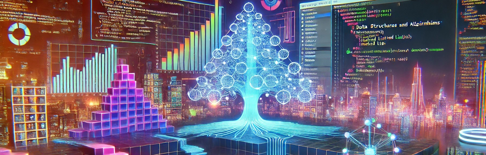
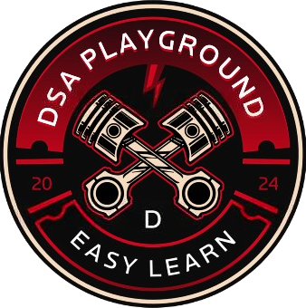

# 🧠 DSA Playground

**DSA Playground** is an interactive platform designed to help students and developers learn **Data Structures and Algorithms (DSA)** through real-time **code execution**, **visual animations**, and **hands-on problem-solving**.



---

## 🔍 Features

- ✨ Real-time Code Compiler supporting Python, C++, Java
- 📊 Visualizations of 40+ DSA algorithms
- 🧩 DSA Questions with Levels & Hints
- 🤝 Duo Code – Collaborate in real-time with friends
- 🧠 DSA GPT – Ask AI questions and get DSA explanations
- 🎯 Algorithm-wise animated visualization (Bubble Sort, Merge Sort, Graphs, Trees, etc.)
- 🔐 Firebase-based user login system
- 🧩 Responsive UI built using React & Tailwind CSS

---

## 🛠️ Tech Stack

- **Frontend**: React.js, Tailwind CSS, D3.js
- **Backend**: Node.js (Express), Firebase, MongoDB (Future)
- **Compiler**: Judge0 API / Custom Code Execution Environment
- **AI**: OpenAI API (DSA GPT)
- **Visualization**: Canvas API, D3.js

---

## 🚀 Getting Started (Local Setup)

1. Clone the repo:
    ```bash
    git clone https://github.com/ShubhamMarwade/DSA-PLAYGROUND.git
    cd DSA-PLAYGROUND
    ```

2. Install frontend dependencies:
    ```bash
    npm install
    ```

3. Setup backend:
    ```bash
    cd backend2
    npm install
    ```

4. Add your `.env` files:
    - `backend2/.env`
    - `src/.env`

5. Run the backend:
    ```bash
    node server.js
    ```

6. Run the frontend:
    ```bash
    npm start
    ```

---

## 📸 Screenshots

| Code Editor | DSA Visualizer | Question Interface |
|-------------|----------------|---------------------|
|  |  |  |

---

## 🙌 Team & Credits

This project was developed as part of the **Final Year Major Project** by:

- **Shubham Marwade** – Full Stack Developer, AI Enthusiast

---

## 📫 Feedback

Got suggestions or ideas?  
Feel free to open an [issue](https://github.com/ShubhamMarwade/DSA-PLAYGROUND/issues) or [pull request](https://github.com/ShubhamMarwade/DSA-PLAYGROUND/pulls).

